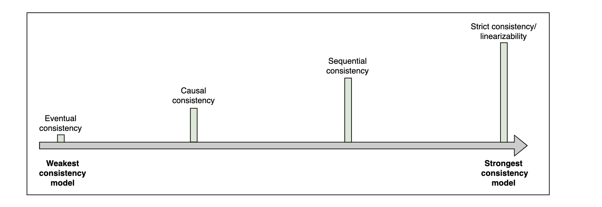

# Spectrum of Consistency Models

## What is consistency?

In distributed systems, consistency may mean many things. For example:

- that each replica node has the same view of data at a given point in time.
- that each read request gets the value of the recent write.

But there are much many more forms of consistency.

**Consistency models** provides us with abstractions to reaons about the correctness of a distributed system doing concurrent data reads, writes and mutations.

The two ends of the consistency spectrum are: **weakest consistency** and **strongest consistency**.

Between these two lie the consistency model, some of which are shown below:

## Eventual consistency

**Eventual consistency** is the weakest consistency model. It's used for applications that don't have strict ordering requirements and don't require reads to always return the latest written data.

This model ensures that all replicas converge on a final values after a finite amount of time, when no more writes are coming in. If new write calls keep coming in, replicans of an eventually consistent system might never reach the same state. Until all replicas converge, different replicas can return different values.

Eventual consistency ensures **high availability**.

**Example:** the DNS is a highly available system that enables name lookups to a hundred million devices across the internet. It uses eventual consistency to maintain high availability, as it doesn't necessarily reflect the latest values.

Also, Cassandra is a highly available NoSQL database that provides eventual consistency.

