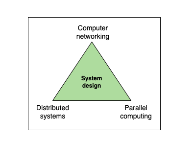
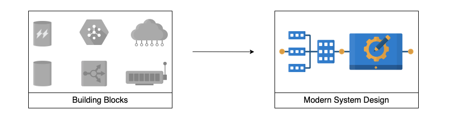

# Introduction to Modern System Design

## What is system design?

**System design** is the process of defining components and their integrations, APIs, and data models to build large-scale systems that meet a specified set of functional and non-functional requirements.

System design uses the concepts of **computer networking**, **parallel computing**, and **distributed systems** to craft systems that scale well and are performant. 

Distributed systems scale well by nature. However, they are inherently complex. And the discipline of system design helps tame this complexity and get the work done.

System design aims to build systems that are reliable, effecitve and maintainable, among other characteristics:

- **Reliable systems** handle faults, failures and errors.
- **Effective systems** meet all user needs and business requirements.
- **Maintainable systems** are flexible and easy to scale up or down. The ability to add new features also comes under the umbrella of maintainability.

## Modern system design using building blocks

We have separated out commonly-used design elements, such as load balancers, as the basic building blocks for high-level system design. This serves two puposes:

1. It allows us to discuss the builduing blocks in detail, and discuss their intersting mini-design problems.
2. When we tacke a design problem, we can concentrate on problem-specific aspects, mention the building block we'll use and how we'll use it. This helps us remove duplicate discussions of commonly-occurring design elements.

We have identified 16 builduing blocks that are crucial in designing modern systems.

## About this course

This coruse is about designing systems that scale with increasing users, remain available under different faults, and meet functional goals with good performance. Real-world system building is an iterative process where we start with a reasonably good design, measure how it performs, and improve the design in the next iteration.