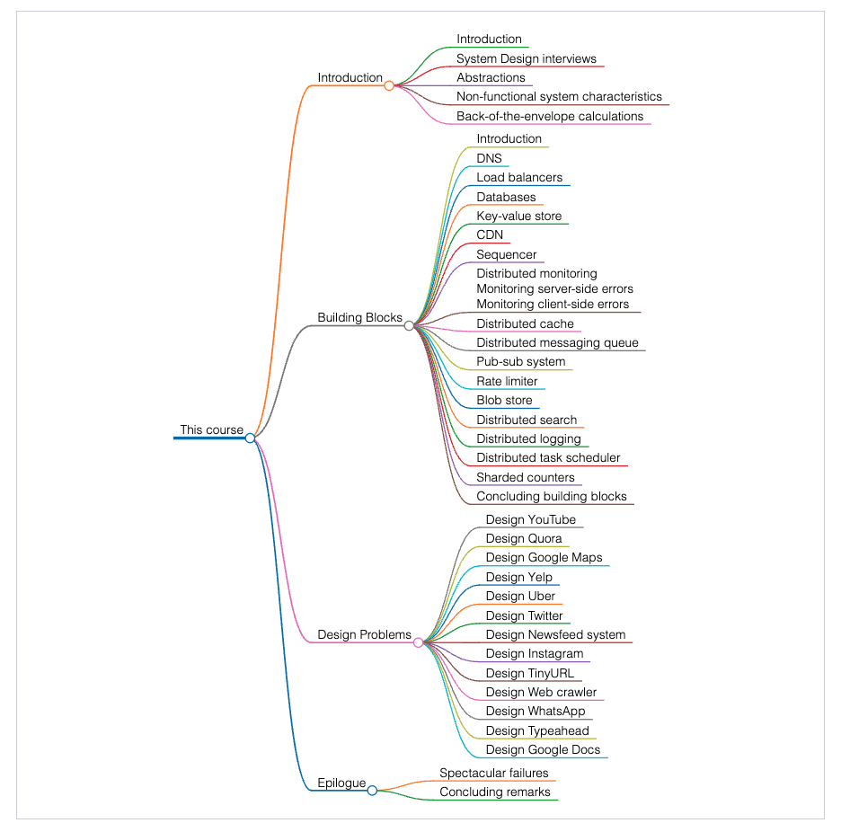
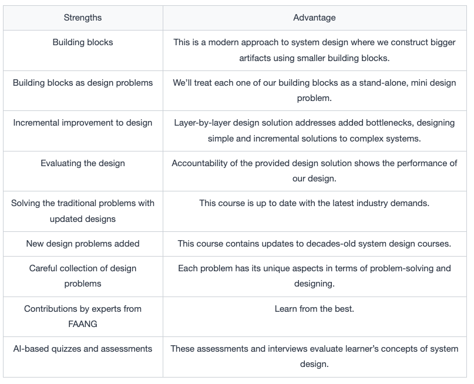

# Course Structure for Modern System Design

## Structure of the course

This course consists of forty chapters. These can be segmented into four different sections:

1. **Introduction:** Composed of five chapters. The first chapter intrpduces the course and its key features. The second one gides on how to prepare for the SD interview. The third chapter talks abouts different types of abstractions. Next, a discussion on indispensable non-functional characteristics that every large-scale system should have. The section finishes with back-of-the-envelope calculations that enable us to estimate resources during our design problems.
2. **Building blocks:** Starts with intrductory lesson presenting 16 different building blocks, each of which is explained in a separate chapter. 
3. **Design problems:**  The meat of the course: 13 design problems.
3. **Epilogue:**  Wrapping up, including "Spectacular Failures".

## Strengths of the course

