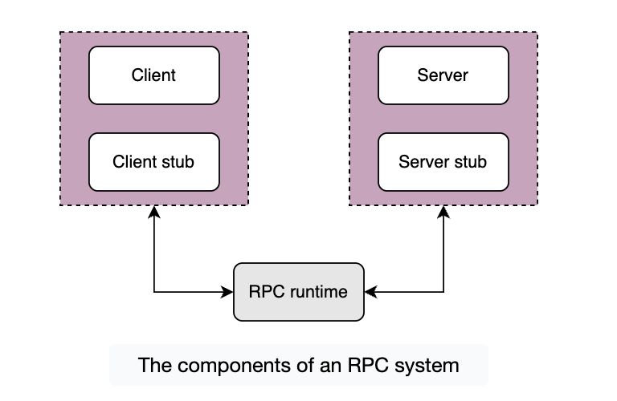
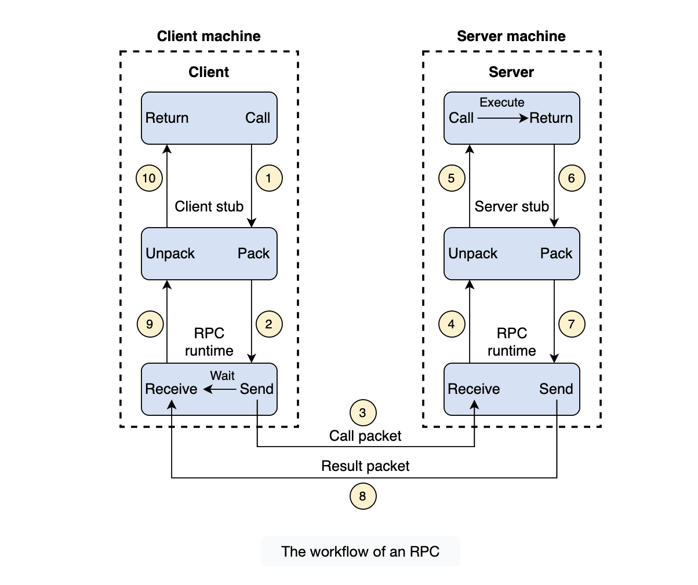

# Why Are Abstractions Important?

## What is abstraction?

**Abstraction** is the art of obfuscating details that we don't need, to allow us to concentrate on the big picture. This enables use to hide inner complexities, thus giving us a broader understanding of our set goals and stay focused on them.

In the context of CS, we use abstractions all the time when using computers for work: we don't start making hardware and OS from scratch.

Developers use libraries to develop systems. They give us an easy interface to use functions and hide the inside details of how they are implemented. A good abstraction allows us to reuse it in multiple projects with similar needs.

## Database abstractions

**Transactions** is a database abstraction that hides many problematic outcomes when concurrent users are reading, writing or mutating the data and gives their users a simple interface of commit (in case of success), or abort (in case of failure). Either way, the data moves from one consistent state to a new consistent state. Transactions enable end users not to be bogged down by the subtle corner-cases of concurrent data mutation, but rather concentrate on the business logic.

## Abstractions in distributed systems

Abstractions in distributed systems help engineers relieeve them of the burden of dealing with the underlying complexity of distributed systems. Toda'ys applications can't remain responsive or functional if they're based on a single node, because of an exponentially growing number of users.

The abstraction of distributed systems has grown in popularity as many big companies like Amazon AWS, Google Cloud, and Microsoft Azure provide distributed services

# Network Abstractions: Remote Procedure Calls

**Remote procedure calls (RPCs)** provide devs with an abstraction of a local procedure call by hiding the complexities of packing and sending function arguments to a remote server, receiving the return values and managing any network retries.

## What is an RPC?

**RPC** is an interprocess communication protocol that's widely used in distributed systems. In the OSI model of network communication, RPC spans the **transport** and **application** layers.

RPC mechanisms are employed when a computer program causes a procedure to execute in a separate address space. The procedure or subroutine is coded as a regular/local procedure call without the programmer explicitly coding the details for the remote interaction.

## How does RPC work?

When we make a **remote procedure call**, the calling environment is paused and the procedure parameters are sent over the network to the env where the procedure is to be executed.

When the procedure execution finishes, the results are returned to the calling env where execution restarts as a regular procedure call.

Let's see an example of a client-server program. There are five components involved in the RPC program:

The client, the client stub and one instance of RPC runtime are running on the client machine. The server, the server stub, and one instance of RPC runtime are running on the server machine.

During the RPC process, the following steps occur:

1. A client initiates a client stub process by giving parameters as normal. The client stub is stores in the adress space of the client.

2. The client stub converts the parameters into a standarized format and packs them into a message. After packing the parameter into a message, the client stub requests the local RPC runtime to deliver the message to the server.

3. The RPC runtime at the client delivers the message to the server over the network. After sending a message to the server, it waits for the messge result from the server.

4. RPC runtime at the server receives the message and passes it to the server stub.

**The RPC runtime is responsible for transmitting messages between client and server over the network. The responsabilities of RPC runtime also include retransmission, ack, and ecryption.**

5. The server stub unpacks the message, extracts the parameters, and calls the desired server routine using a local procedure call to do the required execution.

6. The results of the server routine execution is returned to the server stub.

7. The server stub packs the returned result into a message and send it to the RPC runtime at the server on the transport layer.

8. The server's RPC runtime returns the packes result to the client's RPC runtime over the network.

9. The client's RPC runtime receives the result and sends it to the client stub.

10. The client stub unpacks the results and the execution process retruns to the caller at this point.

**Back-end services use RPC as a communication mechanism of choice due to its high performance and simple abstraction of calling remote code as local functions.**

## Real-world usage.

- **Google**: Google uses RPC in various parts of its distributed infrastructure. They have developed gRPC, an open-source framework that uses RPC to build efficient and highly performant distributed systems. It’s employed for services like Google Search, YouTube, etc., where it allows Google to maintain communication and data exchange between different components of their services, which is essential for achieving real-time performance.

- **Uber**: Uber uses RPC for various functions, including real-time location tracking, ride matching, and communication between drivers and riders. RPC allows Uber to provide fast and responsive services by facilitating data exchange between the user’s app and the server.

- **Facebook**: Most services at Facebook are written using Thrift for RPC, and some storage systems use Thrift for serializing records on disk. This provides several benefits to Facebook. For example, it enables interoperability between different languages, such as a Python client communicating with a C++ server.