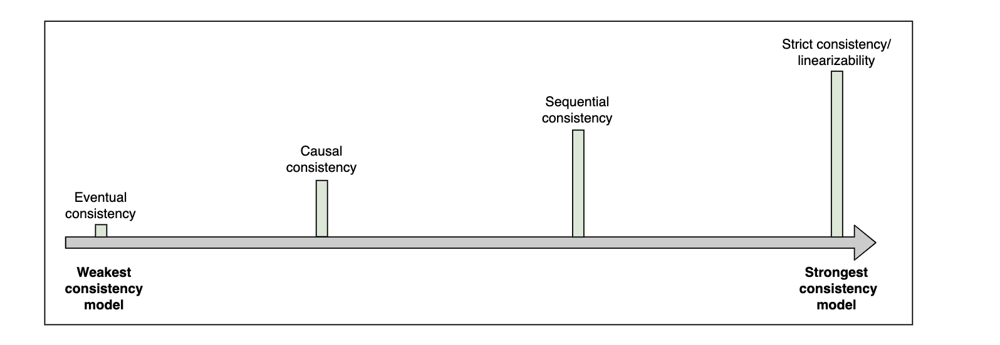
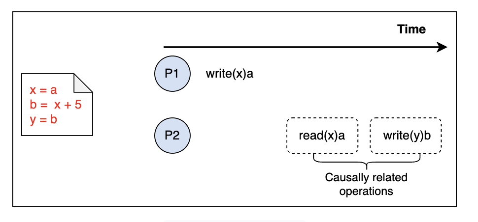
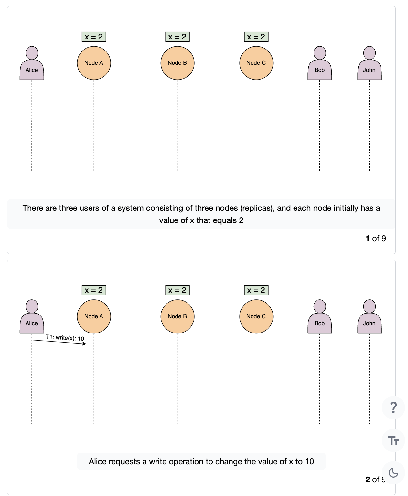
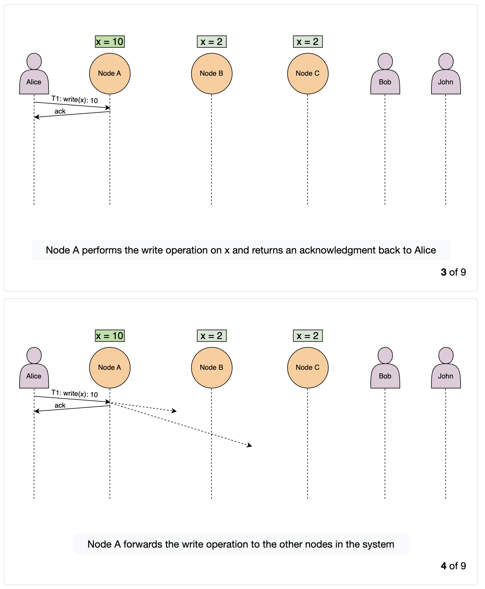
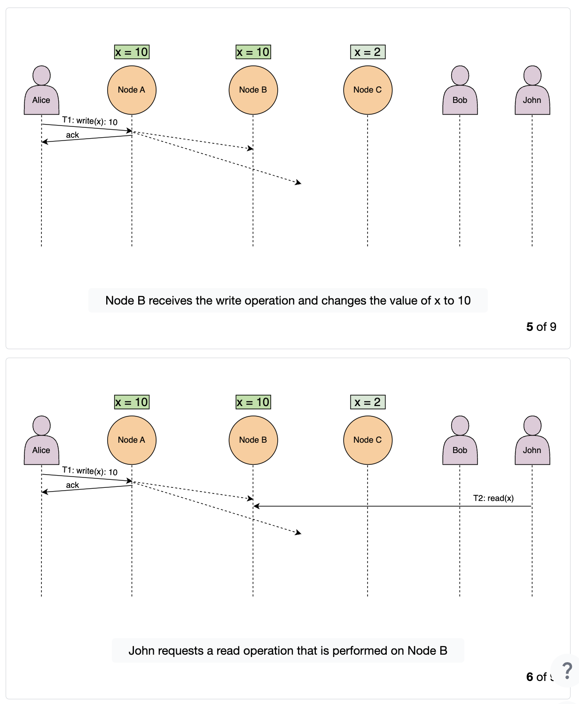
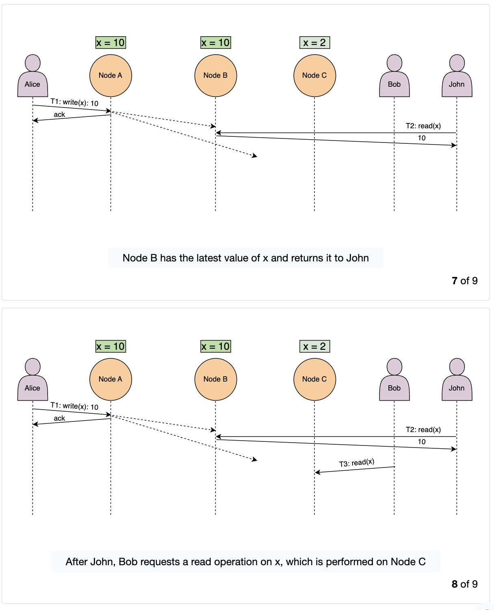
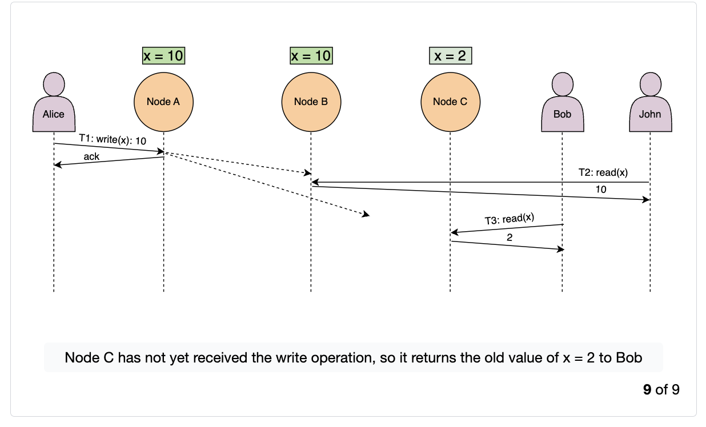

# Spectrum of Consistency Models

## What is consistency?

In distributed systems, consistency may mean many things. For example:

- that each replica node has the same view of data at a given point in time.
- that each read request gets the value of the recent write.

But there are much many more forms of consistency.

**Consistency models** provides us with abstractions to reaons about the correctness of a distributed system doing concurrent data reads, writes and mutations.

The two ends of the consistency spectrum are: **weakest consistency** and **strongest consistency**.

Between these two lie the consistency model, some of which are shown below:

Some models, from weaker to stronger:

- **Eventual consistency**
- **Causal consistency**
- **Sequential consistency**
- ***Strict consistenct/linearizability**

## Eventual consistency

**Eventual consistency** is the weakest consistency model. It's used for applications that don't have strict ordering requirements and don't require reads to always return the latest written data.

This model ensures that all replicas converge on a final values after a finite amount of time, when no more writes are coming in. If new write calls keep coming in, replicans of an eventually consistent system might never reach the same state. Until all replicas converge, different replicas can return different values.

Eventual consistency ensures **high availability**.

**Example:** the DNS is a highly available system that enables name lookups to a hundred million devices across the internet. It uses eventual consistency to maintain high availability, as it doesn't necessarily reflect the latest values.

Also, Cassandra is a highly available NoSQL database that provides eventual consistency.

## Causal consistency

**Causal consistency** works by categorizing operations into dependent and independent operations.

Causal consistency **preserves the order of dependent operations** -also called causally related operations-.

Example: process `P1` writes a value `a` at a location `x`. For process `P2` to write the value `b` at location `y`, it first needs to calculate `b`. Since `b = x + 5`, the read operation on `x` should be performed before writing `b` on location `y`. That's why `read(x)a` and `write(y)b` are causally related.

This model doesn't ensure ordering for operations that are independant, and these can be seen in different possible orders.

This model is weaker overall, but stronger thatn the eventual consistency model.

It's used, for example, in a commenting system, where we want to display the replies after the comment it replies to, since there is a cause and effect relationship between a comment and its replies.

## Sequential consistency

A further stronger model, it preserves the ordering specified by each client's program. However, it doesn't ensure that the writes are visible instantaneously or in the same order as they occurred according to some global clock.

Example: In social networking applications, we usually don’t care about the order in which some of our friends’ posts appear. However, we still anticipate a single friend’s posts to appear in the correct order in which they were created. Similarly, we expect our friends’ comments in a post to display in the order that they were submitted. The sequential consistency model captures all of these qualities.

## Strict consistency (a.k.a linearizability)

**Strict consistency or linearizability** is the strongest consistency model. It ensures that a read request from any replicas will get the latest written value.

Once the client receives the acknowledgement that the write operations has been performed, other clients can read that value.

Strict consistenct is challenging to achieve in a distributed system, due to hurdles such as variable network delays and network failures.

Usually, synchronous replication is one of the ingredients for achieving strong consistency, but it it not sufficient in itself. **Consensus algorithms** such as Paxos and Raft may be neded to achieve it.

**Strong consistenct affects negatively a system's availability**, which is why it's not always used. Applications with strong consistency requirements use techniques like **quorum-based replication** to increase the system's availability.

**Example:** Updating an account's password requires strict consistency. For example, if we suspect suspicious activity on our bank account, we immediately change our password so that no unauthorized users can access our account. If it were possible to access our account using an old password due to a lack of strict consistency, then changing passwords would be a useless security strategy.

**Strong consistency** services have worse performance rates than servies with weaker consistency, in exchange for their strong assurances. Programmers have to compromise performance and availability when choosing a model in the consistency spectrum.

