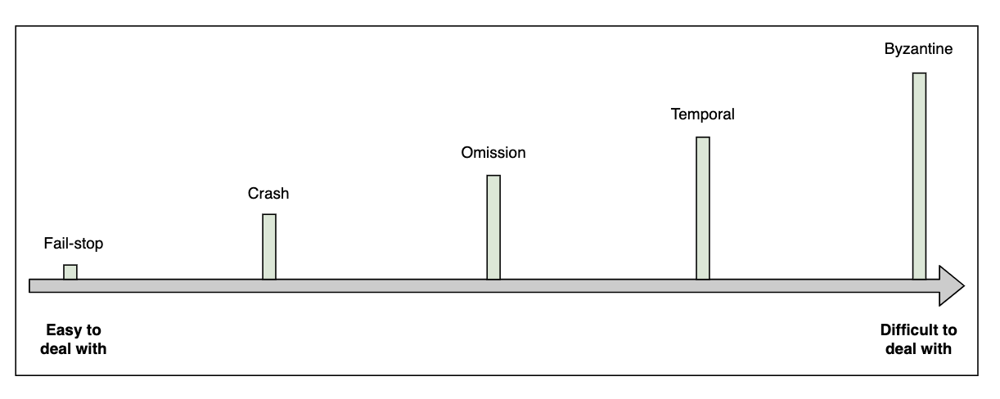

# The Spectrum of Failure Models

Failures are natural in the world of distributes systems and can appear in various ways.

**Failure models** provide us a framework to reason about the impact of failrues and possible ways to deal with them.

Here is an illustration the represents a spectrum of failure models:

From easiest to hardest to deal with:

## Fail-stop

A node in the distributed system halts permanently. However, other nodes can still can reliably detect that the failed component has stopped working. It's also a **clean failure**: the failing component doesn't produce any incorrect outputs or corrupt data before stopping.

Examples of fail-stop failures in real-world distributed systems might include:

- A server experiencing a power failure
- A hard drive crash causing a storage node to become unresponsive
- A network switch failing, causing a portion of the network to become unreachable

Distributed systems are often designed to be resilient to fail-stop failures through techniques like replication, redundancy, and fault-tolerant algorithms.

## Crash

A crash failure occurs when a component in a distributed system abruptly ceases to function but may potentially restart at a later time. This failure mode is distinct from fail-stop failures, where components permanently cease operation. It has the following characteristics:

- Abrupt cessation: The component stops operation without warning.
- Potential recovery: Unlike fail-stop failures, crashed components may restart.
- Detection challenges: Definitively identifying crash failures can be difficult due to the possibility of recovery.
- Data loss risk: In-memory data and incomplete operations may be lost during a crash.

Examples:

- Process crashes due to unhandled exceptions
- Temporary outages of virtual machine instances
- Database server crashes resulting in loss of recent, uncommitted transactions

## Omission failures

An omission failkure occurs when a component in a distributed system fails to respond to or send messages, without completely crashing. This failure mode represents a partial failure where the component continues to operate but fails to perform some of its expected actions.

Unliek crash failures (where a component ceases operation but might restart), or fail-stop failures (where the cessation is permanent and detectable), omission failures manifest as a partial and often intermittent malfunction.

They can be categorized into:

- **Send omissions:** when a component fails to transmit messages it was expected to send.
- **Recieve omissions:** involve a failure to prcoess or acknowledge incoming messages.
- **Network omissions:** messages are list in transit due to network issues, independent of the sender or receiver's functionality.

Examples:

- A congested network switch dropping packets
- An overloaded server failing to process some incoming requests
- A faulty network interface card intermittently failing to transmit messages

Some mitigations strategies include: **timeout mechanisms to detect missing responses**, **message acknowledgement and retransmission protocols**, **redundant communications apths to mitigate network omissions**, **state reconciliation mechanisms to address potential inconsistencies**, and **robust consensus protocols that can tolerate message omissions. (praxos or Raft, for example)**

## Temporal failures

Temporal failures, also known as timing failures, represent a class of failrues in distributed systems where components operate correctly in terms of their actions, but fail to meet specified timing constraints. These failures are particularly significant in real-time systems and applications, where the timeliness of operations is crucial.

In a distributed system, temporal failures can manifest in various ways. A component might respond to slowly, exceeding predefined time bounds. Alternatively, it might respond too quickly, before an expected minimum time has elapsed. In some cases, the relative timing between different events or messages bight be incorrect, leading to synchronization issues.

The causes of temporal failures are diverse. They can result from unexpected system loads, network congestion, resource contention, or poorly implemented algorithms. In some cases, temporal failures may be intermittent, making them challenging to diagnose and reproduce.

Common temporal filures:

- **Clock drift:** over time, the internal click of different components of one distributed system dift apart, leading to inconsistencies in time-stamped events, or causing synchronization protocols to fail.

- **Distributed transactions:**  If a participant in a transaction fails to respond within a specified timeout period, the transaction coordinator must decide whether to commit or abort the transaction. 

The implications of temporal failures can be severe. In financial systems, timing discrepancies can lead to incorrect trading decisions. In industrial control systems, missed deadlines could result in physical damage to equipment. In distributed databases, temporal failures can lead to inconsistent views of data or violated transaction semantics.

