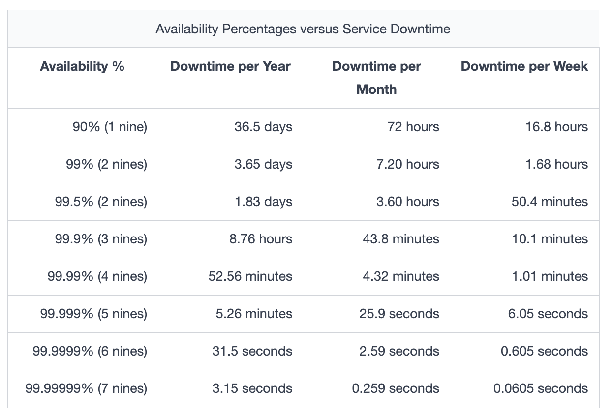

# Availability

## What is availability?

**Availability** is a non-functional characteristic that measures how reliably a system can provide its intended services over time. It represents **the percentage of time a system is operational and accessible to users.**

It is often expressed as a percentage. For example, if a service has 100% availability, it means that the said service functions and responds as intended (operates normally) all the time.

## Measuring availability

Availability $A$ is a ratio, and the higher its value, the better. Its formula is:

$$A = \frac{\text{Total time - Downtime}}{\text{Total time}} * 100$$

We measure availability as a **number of nines**. The following table shows how much downtime is permitted/expected when we're using a given number of nines.

**Factors affecting availability:**

- Hardware reliability
- Software robustness
- Network stability
- Maintenance procedures
- Disaster recovery capabilities

**Strategies to improve availability:**

- Redundancy (e.g., backup systems, load balancing)
- Fault tolerance mechanisms
- Regular maintenance and updates
- Monitoring and quick response to issues

**Trade-offs:** higher availability often comes at the cost of increased complexity and cost.

## Availability and service providers

Each service provider may start measuring availability at different points in time. Some cloud providers start measuring it when they first offer the service, while some measure it for specific clients when they start using the service. Some providers might not reduce their reported availability numbers if their service was not down for all the clients. The planned downtimes are excluded. Downtime due to cyberattacks might not be incorporated into the calculation of availability. 

Therefore, we should carefully understand how a specific provider calculates their availability numbers.