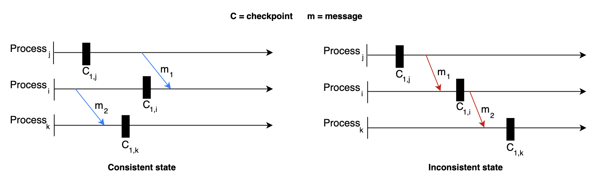

# Fault Tolerance

## What is fault tolerance?

**Fault tolerance** refers to a system's ability to execute persistently even if one or more of its components fail. Components can be software or hardware. A system that is 100% fault-tolerant is very difficult to achive.

## Fault tolerance techniques

Failure occurs at the hardware or software level, which eventually affects the data. Fault tolerance can be achieved by many apporaches, considering the system structure. Let's discuss the techniques taht are significant and suitable for most designs:

### Replication

**Replication-based fault tolerance** is the technique of replicating both services and data: when they fail, failed nodes are swapped with healthy ones and failed data stores are swapped by their replicas. 

We create multiple copies of our data in separate storage. All copies need to update reularly for consistency when any update occurs in the data. Updating data in replicas is a challenging job. When a system needs strong consistency, we can synchronously update data in replicas. however, this reduces the availability of the system. We can also asynchronously update data in replicas, we we can tolerate eventual consistency, resulting in stale reads untill all replicas converge.

Therefore, there is a trade-off between both approaches: we compromise on availability or on consistency: a reality that is outlined in the CAP theorem.

> CAP Theorem

### Checkpointing

**Checkpointing** is a techquine that saves the system's state in stable storage for later retrieval in case of failures due to errors or service disruptions.

Checkpointing is a fault tolerance technique performed in many stages at different time intervales. When a distributed system fails, we can get the last computed data from the previous checkpoint and start working from there.

Checkpointing is performed for different individual processes in a system in such a way that they represent a global state of the actual execution of the system. Depending on the state, we can divide checkpointing intwo two types:

- **Consistent state:** A state in which all the individual processes of a system have a consistent view of the shared state or sequence of events that have occurred in a system. Snapshots taken in consistent state have data in coherent states, representing a possible sistuation of the system. For a checkpoint to be consistent, typically, the following criteria are met:
    1. All updates to data that were completed before the checkpoint are saved. Any updates to data that were in progress are rolled back as if they didn't initiate.
    2. Checkpoint include all messages that have been sent or received up until the checkpoint. No messages are in transis (in-flight) to avoid cases of missing messages.
    3. Relationships and dependencies between system components and their states match what would be expected during normal operation.
- **Inconsistent state:** A state where there are discrepancies in the saved state of different processes of a system. In other words, the checkpoints across different processes are not coherent and coordinated.

Let's look at an example to understand consistent and inconsistent states in a better way:

Consider three procesess represented by $i$, $j$ and $k$. Two messages, $m_1$ and $m_2$ are exchanged between the processes. Other than taht, we have one snapshot or checkpoint saved for each process: $C_i$, $C_j$ and $C_k$.

On the left illustration, the first checkpoint at processes $j$ and $i$ are consistent because $m_1$ is sent and receied after the checkpoints. On the contrary, in the right-hand illustration, the first checkpoint at process $j$ doesn't know about $m_1$, while the first checkpoint at process $i$ recorded the reception of message $m_1$. Therefore, it's an inconsistent state.

The left-hand illustration represents a consistent state also because no communication is being performed among the processes when the system performs checkpointing. On the right side, we can see that the processes communciate through messages when the system performs checkpointing.