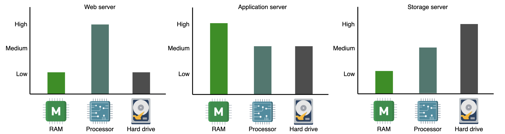

# Back-of-the-envelope Calculations

## Put Back-of-the-envelope Calculations in Perspective

**Back-of-the-envelope calculations (BOTECs)** involve swift, approximate, and simplified estimations or computations typically done on paper, or figuratively, on the back of an envelope. They are not intented to yield precise results, but rather to function as a quick and preliminary evaluation of crucial parameters and the feasibility of a system.

For example, let’s say we’re in a city and want to estimate the population of a particular neighborhood. We could count the number of houses in a sample area, estimate the average number of people per household, and then extrapolate to the whole neighborhood. Similar calculations can be used to check the validity of census data for some neighborhoods.

### BOTECs in system design

A modern system is a complex web of computational resources connected via a network. Different kinds of nodes, such as load balancers, web servers, application servers, caches, in-memory databases and storage nodes collectively serve the clients.

Such a system might be architected in different ways, including a monolithic structure, a modular monolith architecture or a microservices architecture. Precisely considering such richness at the design level (especially in an interview) isn't advisable, and sometimes, it's impossible.

So BOTECs help us ignore the nitty-gritty details of the system on the design level and let us focus on more important aspects, such as finding the feasibility of the service in terms of computational resources.

Some examples where we often need BOTECs are the following estimations:

- The number of concurrent TCP connections that a server can supports
- The number of requests per second (RPS) that a web, database or cache server can handle
- The storage requirements of a service

Using BOTECs, we abstract away the messy details specific to different kinds of servers used in the actual system, the different access latencies of system components, different throughput rates, and the different types of requests.

As we move forward, we'll first look into these different server types, access latencies, throughput numbers and request types to know the reality of the systems and see how complex they are. Then, abstracting away these details, we'll learn to estimte the number of RPS a server can handle. Finally, we'll practice bandwidth, servers and storage estimation examples.

### Types of data center servers

Data centers don't have a single type of server: below we discuss the different types commonly used within a data center to handle different workloads:

#### Web servers

For scalability, web servers are decoupled from application servers. **Web servers** are the first point of contact after load balancers. They usually handle API calls from clients. Depending on the service that's offered, the memory and storage in web servers can be small to medium, but **require good processing resources**. 

#### Application servers

**Application servers run the core application software and business logic.** The difference between this type and web servers is somewhat fuzzy. Application servers primarily provide dynamic content, wheras web servers mostly serve static content to the client. They can require extensive computational and storage resources. They can be volatile and non-volatile.