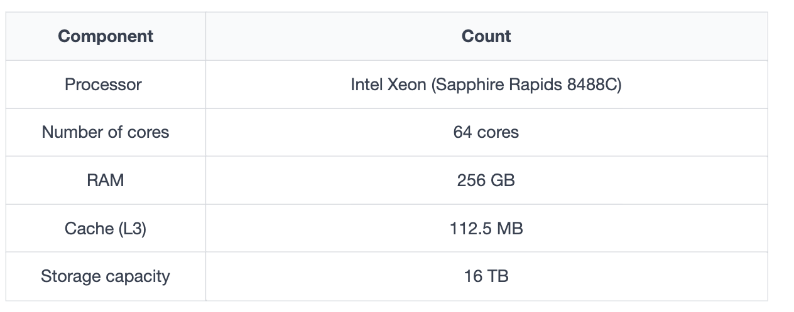

# Back-of-the-envelope Calculations

## Put Back-of-the-envelope Calculations in Perspective

**Back-of-the-envelope calculations (BOTECs)** involve swift, approximate, and simplified estimations or computations typically done on paper, or figuratively, on the back of an envelope. They are not intented to yield precise results, but rather to function as a quick and preliminary evaluation of crucial parameters and the feasibility of a system.

For example, let’s say we’re in a city and want to estimate the population of a particular neighborhood. We could count the number of houses in a sample area, estimate the average number of people per household, and then extrapolate to the whole neighborhood. Similar calculations can be used to check the validity of census data for some neighborhoods.

## BOTECs in system design

A modern system is a complex web of computational resources connected via a network. Different kinds of nodes, such as load balancers, web servers, application servers, caches, in-memory databases and storage nodes collectively serve the clients.

Such a system might be architected in different ways, including a monolithic structure, a modular monolith architecture or a microservices architecture. Precisely considering such richness at the design level (especially in an interview) isn't advisable, and sometimes, it's impossible.

So BOTECs help us ignore the nitty-gritty details of the system on the design level and let us focus on more important aspects, such as finding the feasibility of the service in terms of computational resources.

Some examples where we often need BOTECs are the following estimations:

- The number of concurrent TCP connections that a server can supports
- The number of requests per second (RPS) that a web, database or cache server can handle
- The storage requirements of a service

Using BOTECs, we abstract away the messy details specific to different kinds of servers used in the actual system, the different access latencies of system components, different throughput rates, and the different types of requests.

As we move forward, we'll first look into these different server types, access latencies, throughput numbers and request types to know the reality of the systems and see how complex they are. Then, abstracting away these details, we'll learn to estimte the number of RPS a server can handle. Finally, we'll practice bandwidth, servers and storage estimation examples.

### Types of data center servers

Data centers don't have a single type of server: below we discuss the different types commonly used within a data center to handle different workloads:

#### Web servers

For scalability, web servers are decoupled from application servers. **Web servers** are the first point of contact after load balancers. They usually handle API calls from clients. Depending on the service that's offered, the memory and storage in web servers can be small to medium, but **require good processing resources**. 

- Primary function: Serve static content (HTML, CSS, images, etc.)
- Handle HTTP requests directly from clients (usually web browsers)
- Examples: Apache HTTP Server, Nginx, Microsoft IIS

#### Application servers

**Application servers run the core application software and business logic.** The difference between this type and web servers is somewhat fuzzy. Application servers primarily provide dynamic content, wheras web servers mostly serve static content to the client. They can require extensive computational and storage resources. They can be volatile and non-volatile.

- Primary function: Execute application/business logic
- Host and run applications, often handling dynamic content generation
- May interact with databases and other backend services
- Examples: Tomcat, JBoss, WebSphere, Gunicorn

**Key differences between web and application servers:**

- Content type: Web servers mainly handle static content, while application servers deal with dynamic content and application logic.
- Processing: Web servers have limited processing capabilities, whereas application servers can perform complex computations.
- Language support: Web servers are generally language-agnostic, because their primary function is to serve static content and handle HTTP requests, which doesn't require them to undersstand or execute code written in specific programming languages. Meanwhile application servers are often language or framework-specific, ecause they need to execute application code, manage application lifecycles, and provide language-specific features and optimizations.
- Scalability: Application servers are typically designed to handle more concurrent connections and heavier loads.

#### Storage servers

Storage servers play a crucial role in managing the vast amounts of data generated and consumed by various applications and services. They are specialized computer systems designed to store, manage and provide access to large amounts of data.

#### Types of Storage servers

Storage servers can be broadly categorized based on their underlying data management systems:

1. **SQL-based storage servers**
  - Use RDBMS (relational database management systems)
  - Ideal for structured data with predefined schemas
  - Run software like MySQL, PostgreSQL or Oracle
  - Excel at managing complex relationships between data points
  - Commonly used for transactional data such as financial records or inventory management

2. **NoSQL-based Storage Servers**
  - Designed for flexible, schema-less data storage and large-scale distributed systems
  - Includes document stores like MongoDB, key-value stores such as Redis, wide-column stores like Cassandra and graph databased like Neo4j.
  - Particularily well-suited for handling user data, metadata and high velocity streams from sources like IoT sensors.

3. **Specialized Storage Solutions**
  - Stands between the two previous categories, and caters to specific use cases or data types.
  - May leverage SQL, NoSQL or entirely custom technologies.
  - Examples: blob storage for managing large binary objects like videos and images, distributed file systems like Hadoop HDFS for big data analytics, and time-series databased for handling sequential data points.

Returning to the example of Facebook: they've used storage servers with storage capacity of up to 120 TB, so it is able to house exabytes of storage. However, the RAM of these servers is only 32 GB.

## Referece point for our calculations

In the table below, we depict the capabilites of a typical server (Amazon EC2 M7i-flex instances, powered by 4th Generation Intel Xeon Scalable processors) that can be used in the data centers of today:

- **Processor:** Intel Xeon (Sapphire Rapids 8488C)
- **Number of cores:** 64 cores
- **RAM:** 256 GB
- **Cache (L3):** 112.5MB
- **Storage capacity:** 16TB

### Important latency numbers to remember

Latencies play an important role in deciding the amount of workload that a machine can handle. The list below depicts some of the important numbers system designers should know in order to perform resource estimation:

| Operation name | Time |
|----------------|------|
| L1 cache reference | 0.5 ns |
| Branch mispredict | 5 ns |
| L2 cache reference | 7 ns |
| Mutex lock/unlock | 100 ns |
| Main memory reference | 100 ns |
| Compress 1K bytes with Zippy | 10,000 ns = 10 μs |
| Send 2K bytes over 1 Gbps network | 20,000 ns = 20 μs |
| Read 1 MB sequentially from memory | 250,000 ns = 250 μs |
| Round trip within the same datacenter | 500,000 ns = 500 μs |
| Disk seek | 10,000,000 ns = 10 ms |
| Read 1 MB sequentially from the network | 10,000,000 ns = 10 ms |
| Read 1 MB sequentially from disk | 30,000,000 ns = 30 ms |
| Send packet CA (California) -> Netherlands->CA | 150,000,000 ns = 150 ms |

Remembering the order of magnitude difference between different components and operations is more important than remembering the exact numbers. For example, we should know that **doing IO-bound work (for example, reading 1 MB data sequentially from the SSD disk) is two order of magnitude slower than CPU-bound work (for example, compressing 1KB of data)**.

The reason the data sized are different in comparison is that, as long as the data to compress is readily available to the processor from the L1, L2, or L3 caches, the time to compress will be relatively consistent. The data up to the size of the L3 cache of the server (which is normally a few MBs - 45 MBs for example, as mentioned above) fits entirely within the cache, and therefore, compressind data up to this limit will take almost the same time: the processor can quickly access this data in the cache without incurring the additional latency associated with fetching data from slower layers like RAM memory or storage.

> L1, L2, and L3 caches: see [here](./Extra%201:%20L1,%20L2%20and%20L3%20caches.md).

> Clock cycles: see [here](./Extra%202:%20CPU%20Clock%20cycles.md).

### Important throughput rates (QPS) to remember

Apart from latencies, throughput numbers are measures as queries per second (QPS) that a typical single-server datastore can handle.

| Type of storage | QPS handled |
|----------------|------|
| SQL | 1000 |
| Key-value | 10,000 |
| Cache server | 100,000 - 1 Million |

The numbers above are approximations and vary greatly depending on reasones like the type of query, the machine specs, load on the server, etc.

> **NOTE**: For real projects, initial designs use BOTECs similar to the ones we use in a system design interview. As the design goes through iterations for real products, we might use reference numbers from some synthetic workload that match our requests (for example, spec int for CPU characterizations and TPC-C for measuring database transactions per unit time). Initial prototypes are used to validate design-level assumptions. Later on, built-in monitoring of resources and demand is carefully analyzed to find any bottlenecks and for future capacity planning.

**Why does a key-value store serve an order of magnitude more QPS compared to a SQL databes?**

Because a typical key-value stores has a simpler API (`put` and `get`) compared to a relational database query that needs to go through query planning before query execution. Similarly, **in-memory caches in RAM**, have `read` and `write` operations, which are simpler than a DB or key-value query.

**We need to keep the relative benefits of these systems (relational DB, key-value store and in-memory cache)**

### Request types

While estimating the number of requests a server can handle, we don't get into the details of what kind of requests we're going to calculate for. But in realy, all requests are not the same. Workloads (client requests) can be broadly classified into thre categories:

1. **CPI-bound requests:** Depend primarily on the processor of a node. An example of this type of requests is compressing 1KB of data as zip. From the table above, see that such an operations takes around 3 microseconds.

2. **Memory-bound requests:** These types of requests are bottlenecked by the memory subsystem. Example: reading 1 MB of data sequentially from the RAM of a node. From the table, that takes 9 microseconds (3 times slower than a CPU-bound operation!)

3. **IO-bound requests:** These are bottlenecked by the IO subsystem, such as disks or the network. An example is reading 1MB sequentially from a disk drive. Such an operation takes around 200 microseconds (66 times slower than a CPU-bound operation!)

Therefore we say: **if a CPU-bound request takes $X$ time units to complete some work on a node, a memory-boundy request is an order of magnitude slower (takes $10X$ time units), and an IO-bound request are two order of magnitude slower (takes $100X$) than the CPU-bound workload.**

### Abstracting away the complexities of a real system

Real system are complex, and taking them into account in an interview is impractical. So we'll using BOTECs moving forward.

#### Request estimation in system design

This section discusses the number of requests a **typical server** can handle in a second. A real request will touch many nodes in a data center for different kinds of processing before a reply can be sent back to the client, and we'll accumulate all such work for our estimations.

The following equation calculates the CPU time to execute a program (request). For simplicty, **we assume that each instruction can be executed in one clock cycle**.

Therefore, $\text{CPI}$ (clock cycles per instructions) is 1 in the following equations.

Let's assume the average clock rate for our server's processor is $3.5 \text{GHz}$ (3,500,000,000 cycles per second). It's reasonable to assume that a request will consume a few million instructions for full processing. For simplicity , let's assume that, on average, each request needs 3.5 million instructions.

$$ \text{CPU}_\text{time per request} = \text{Instructions per request} \space \times \text{CPI} \times \text{CPU time per clock cycle}$$
$$ \text{CPU}_\text{time per request} = \frac{\text{Instruction}}{\text{Request}} \space \times \frac{\text{Clock Cycles}}{\text{Instruction}} \times \frac{\text{Seconds}}{\text{Clock Cycles}} = \frac{\text{Seconds}}{\text{Request}}$$

So we can see that the result is in seconds per request, the time taken by the CPU to process each request.

Now let's put the assumed values in the equation. But before that, we need to find the last term of our equation, the $\text{CPU time per clock cycle}$, given that our CPU frequency equals 3.5 GHz:

$$ \text{Clock cycles per second for a CPU of 3.5GHz clock rate} =  3.5 \times 10^9 \frac{1}{s}$$

$$\text{CPU time per clock cycle} = \frac{1}{3.5 \times 10^9 \frac{1}{s}} = \frac{1}{3.5 \times 10^9} s$$

Replacing all values in the equations gives us: 

$$ \text{CPU}_\text{time per request} = \text{Instructions per request} \space \times \text{CPI} \times \text{CPU time per clock cycle}$$

$$ \text{CPU}_\text{time per request} = (3.5 \times 10^6) \ \space \times 1 \times \frac{\text{1}}{3.5 \times 10^9} = 0.001 \space \text{seconds}$$

And we can thefore calculate total requests a CPU can handle in one second:

$$ \text{Total requests a CPU executes in 1 second} = \frac{1}{0.001} = \frac{1}{10^{-3}} = 1000 \space \text{requests}$$

And therefor for a 64 core server:

$$ \text{Total requests a 64 core server executes in 1 second} = \frac{1}{0.001} = \frac{1}{10^{-3}} = 64.000 \space \text{requests}$$

Not that we have avoided the complexities related to CPU, memory or io-bound requests and system archtecture - this is the hallmark of BOTECs.

Next, we'll use our RPS numbers for server estimation with other resources, such as storage and network bandwith.

---

## Examples of Resource Estimation

Let's now estimate resources liek servers, storage and bandwith. We'll use Twitter as an example to make assumptions and make estimations based on that.

### Number of servers required

Let’s make the following assumptions about a Twitter-like service:

**Assumptions:**

- There are 500 M daily active users (DAU)
- A single user makes 20 requests per day on average
- We know that a single server (with 64 cores) can handle 64.000 RPS.

So, to **estimate the number of requests per second:**

$$ \text{Total requests per second} = \frac{500 M \frac{DAU}{day} \times 20 \frac{req}{DAU} }{3600 \frac{s}{h}\times 24h} = 115.000 \space \frac{\text{req}}{s} $$

And therefore, **to estimate the number of servers needed:**

$$ \text{Number of servers needed} = \frac{\text{Number of requests per second}}{\text{RPS handled by 1 server}} = \frac{115.000}{64.000} ≈ 2 \space \text{servers to handle all requests} $$

Notice that there's a hidden assumption in our calculations above: when we divided the daily user requests by the number of second in a day, we assumed that those requests were uniformly distributed over the second of the day. Is that reasonable? Rarely will a service get such a uniform distribution of requests. So doing this type of calculation can be considered a **lower bound** on the resource.

We can do a **plausibility test**: for all BOTECs, we need to judge if our numbers seems reasonable: If the estimate was two servers for a large service with millions of DAUs, that number seems far from reality, even for a lower bound.

### Peak capacity

Large services need to be ready for flash crowds. So we can make an estimate for the **peak capacity** by just saying that there's a specific second in the day when all the requests of all our DAUs arrive simultaneously.

Doing this the number of servers needed at peak load becomes:

$$ \text{Number of servers needed at peak} = \frac{\text{Number of requests per second}}{\text{RPS handled by 1 server}} = \frac{50 M \times 20}{64.000} ≈ 157.000 \space \text{servers to handle all requests} $$

Our calculations now say we'd need 157.000 servers! Which sounds simply not feasible. So we have two potential paths forward:

1. **Improving the RPS of a server:** while possible (there are real-case examples for this), it is usually at the expense of focused R&D efforts and related dollar cost.

2. **Improving the peak load assumption**:

The more reasonable option is to change our assumption for the peak load. For example, we could use a request and response distribution, or follow a particular type of distribution, for example, Poisson.

But using the **Pareto principle** is a reasonable approach in most cases: it suggest that approximately 80% of the effects comes from 20% of the causes. Applied to our case, we can assume that 80% of our peak traffic occurs within 20% of the time of the day, that is a 4.8 hours window in 24 hours.

$$ \text{Servers needed at peak} = \frac{\text{Number of requests per second}}{\text{RPS handled by 1 server}} = \frac{\frac{0.8 \times 50 M \times 20}{4.8 \times 3600 s}}{64.000} ≈ 8 \space \text{servers to handle all requests} $$

Notice again that we've assumed that the requests are equally distributed in the 4.8 hour window, but there's already a huge difference with respect to the case where all requests show up concurrently. 

Nevertheless, when we build systems on assumptions like these, we need to set up monitoring systems to ensure they are not violated: if the load gets higher than we predict, we can use techniques like load-shedding, circuit-breakers and throttling (rate limiting).

#### Graceful degradation

Flash crowds are possible, even causing a situation where all DAUs come in simultaneously. For example a service hosting a dynamic and personalized website for a large news organization.

In an event like 9/11 maybe all DAUs will make requests simultaneously. How can we **gracefully degrade** the service to meet such an expected load.

Some options:

1. We can **abandon per-user personalization**, since users mostly care about reading about current events.
2. We can **shift to a static-like website** where content is pushed to **CDN nodes** and updated by the service when new updates come in. This makes request/responses fast, as users get their data from CDNs, which will have multiple edge nodes near customers.
3. We can **reduce the use of multimedia content**, so the clients, whose networks might also be congested, could get information in fewer bytes.

### Cost of servers

Let's an EC2 instance type called: **m7i.16xlarge**, with a 64-core processor and 256 GB of RAM, to make our cost estimation.

Its **cost per hours is: 3.54 $/hour** with a 1-year contract plan.

Its specifications are:

| Instance Size | vCPU | Memory (GiB) | Instance Storage (GB) | Network Bandwidth (Gbps) | EBS Bandwidth (Gbps) |
|--------------|------|--------------|---------------------|------------------------|-------------------|
| m7i.16xlarge | 64   | 256          | EBS-Only            | 25                     | 20                |

So we can do some simple maths to get the cost of our servers handling the different assumptions of our load:

**Lower bound server cost, per hour:**

$$ 2 \space \text{servers} \times 3.548 \space \$/\text{server-h} =  7.096 \space \$/h $$

**Cost under the 80-20 assumption**

$$ 8 \space \text{servers} \times 3.548 \space \$/\text{server-h} =  28.38 \space \$/h $$

**Cost under the all-simultaneous DAUs peak load**

$$ 157,000 \space \text{servers} \times 3.548 \space \$/\text{server-h} =  557,061 \space \$/h $$

Notice how the const can quickly pile up. In real life, the dollar budget for server is a hard constraint.

### Storage requirements

Let's see now how to do **storage estimation** by using Twitter as an example. We can estimate Twitters storage requirements for new tweets in 1 year. We do the following assumptions:

- 500 M DAUs
- Each user posts an average of 3 tweets per day
- 10% of tweets contain images, while 5% contain videos. They have either images or video, not both.
- An image weights an average 200 Kb and a video 3 Mb.
- The tweet text and its metadata require a total of 250 bytes of storage.

So we can easily calculate:

$$ \text{Total tweets per day} = 500 M \times 3 = 1500 M = 1500 \times 10^6 $$

$$ \text{Storage required for tweets of 1 day} = 1500 \times 10^6 \times 250 B = 375 \times 10^9 B = 375\space GB $$

$$ \text{Storage required for images of 1 day} = 1500 \times 10^6 \times 0.1 \times 200 \times 10^3 B = 30 \times 10^{12}B = 30\space TB $$

